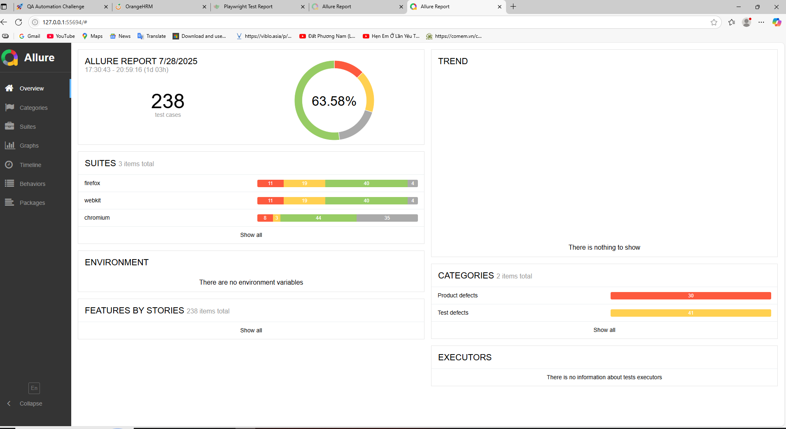

# Challenge‑Test Framework

A robust **Playwright + TypeScript** E2E automation framework for web apps, supporting cross‑browser, parallel execution, data‑driven tests, API calls, video/screenshot capture, retries, and rich reporting (Playwright HTML & Allure). Fully integrated with GitHub Actions (and easily portable to Jenkins or other CI).

---

## Key Features

- **Cross‑Browser Testing**: Chromium, Firefox, WebKit  
- **Parallel Execution**: multi‑worker, data‑driven  
- **Retries & Flakiness Handling**  
- **UI & API Tests** in the same project  
- **Artifacts**: videos, screenshots, traces  
- **Reports**:  
  - Playwright’s built‑in HTML reporter  
  - Allure HTML reports  
- **CI/CD Ready**: sample GitHub Action workflow included  

---

## Supported Test Types

| Category             | Description                              |
| -------------------- | ---------------------------------------- |
| End‑to‑End (E2E)     | Full user flows via UI                   |
| Functional           | Component/page‑level UI checks           |
| API                  | Direct HTTP calls & schema/assertion     |
| Regression & Smoke   | Quick sanity checks                      |
| Performance (future) | Load/stress tests via API or UI          |

---

## Where to Run

| Environment     | Test Types                   | Notes                          |
| --------------- | ---------------------------- | ------------------------------ |
| **Local**       | E2E, Functional, API         | `npm run test`                 |
| **GitHub Actions** | E2E, Functional, API      | `.github/workflows`            |

| Test Domain     | Description                  |
| --------------- | ---------------------------- |
| **SIT**         | System Integration Testing   |
| **UAT**         | User Acceptance Testing      |

---
## Framework Structure
.
├── .env                        # env vars 
├── package.json                # Scripts, deps & devDeps
├── playwright.config.ts        # Global Playwright settings
├── .gitignore
├── tsconfig.json               # TypeScript compiler config
├── utils/
│   └── config.ts               # Single source of truth for all config/env
├── tests/
│   ├── data/
│   │   ├── testLoginData.ts    # All login scenarios (data‑driven)
│   │   └── testSearchData.ts   # All search scenarios (data‑driven)
│   ├── ui/pages/
│   │   ├── LoginPage.ts        # Page‑Object for the login screen
│   │   └── DashboardPage.ts    # Page‑Object for Admin → User Management
│   └── ui/specs/
│       ├── login.spec.ts       # Data‑driven login tests
│       └── search.spec.ts      # Data‑driven search tests
└── .github/
    └── workflows/
        └── playwright.yml      # CI pipeline for GitHub Actions

## Getting Started

### 1. Prerequisites

- [Node.js](https://nodejs.org/)

### 2. Clone & Install

```bash
git clone <https://github.com/minhphuEP/challenge-test>
cd challenge‑test
npm install
```

### 3. Running Tests

- All tests
```bash
npm run test
```

- Generate & open Allure report
```bash
npm run allure:generate
```

- Only Chromium
```bash
npm run test:chrome
```

- Parallel worker
Edit workers: N in playwright.config.ts
- Retries
Edit retries: X in playwright.config.ts

#### The detailed report
